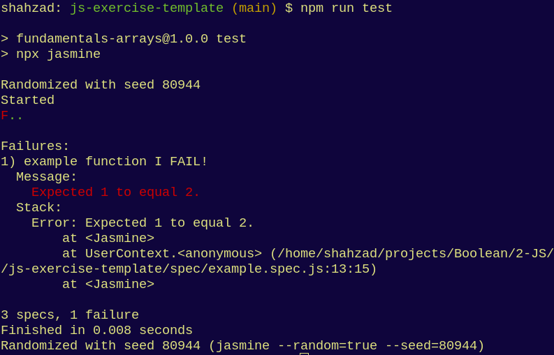
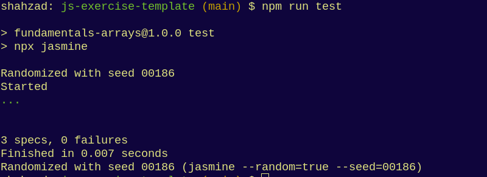

# Programming Fundamentals: Variables

## Learning Objectives

- Understand how to use the different Javascript variable types
  - [MDN Javascript Variables](https://developer.mozilla.org/en-US/docs/Learn/JavaScript/First_steps/Variables)
    - const
    - let

## Introduction

In this exercise you will learn how to declare and use Javascript variables

## Setup

- Fork this repository and clone your forked version to your machine
- Install dependencies by running the command below while in the project's root directory:

  `npm ci`

## Instructions

- Read through the numbered comments in the following files to understand the requirements of this exercise.

  - `src/declaration.js`
  - `src/assignment.js`

- Write your code directly below the numbered comment.

- Add `console.log()`s to get visibility on your solution and run the file with the command `node src/<file>.js` _etc_

- See `src/example.js` for some examples

# Running Tests

## Functional Tests

- To verify your solutions, run the test suite by running the `npx jasmine` command followed by the path to the corresponding test file for each `src/*.js` file above, eg:

  `npx jasmine spec/declaration.spec.js`

- Alternatively, run:

  `npm test`

- To begin with, almost all of the tests will fail - example tests, if they exist, will pass with a green `.` You'll see many red `F`s in your console, like the image below:

  

- Your solution is complete when the all the red `F`s have been replaced with green `.`s in your console, as shown below:

  

## Formatting Tests

When you try to `git commit` any work you've staged using `git add`, there is an additional test that runs that checks the formatting of your work against a set of rules we've defined. To run these tests locally use the following:

```sh
$ npx eslint src
```

You will then need to resolve the errors before successfully committing your work. You can also do this automatically with this command - but try to understand what well-formatted code looks like so you don't simply rely on this magic fix!

```
$ npx eslint src --fix
```

NB: If you fix these formatting errors, don't forget to `git add` and then `git commit` your changes before `git push` back to your remote repository

## Extensions

- Extension exercises can be found in the `src/extensions` directory with corresponding tests in the `spec/extensions` directory.

- To run the tests for the extensions, you can either run spec files individually as follows:

  `npx jasmine spec/extensions/<file>.spec.js`

- Alternatively, run:

  `npm run test-extensions`

## Advanced extensions

Similarly to the extensions, run the `/spec/advanced/<file>.spec.js` scripts.
